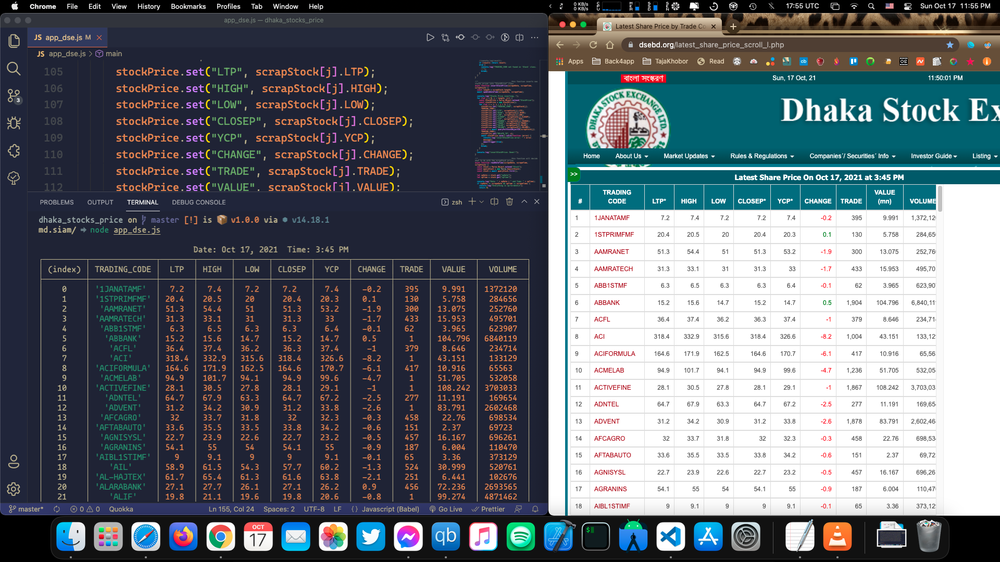

# Dhaka Stocks Exchange

This app uses 'cheerio' npm package to web scrap the official site of [Dhaka Stock Exchange](https://www.dsebd.org/latest_share_price_scroll_l.php). In addition, it is connected to ParseServer for storing the scripted values.

## Screenshot

<a href="#"></a>

# Installation

Copy & paste these following commands:

```
$ git clone https://github.com/md-siam/dhaka_stocks_price.git
$ npm install
$ node app_dse.js
```

To run this app you will need [git](https://git-scm.com/) & [nodeJs](https://nodejs.org/en/)
